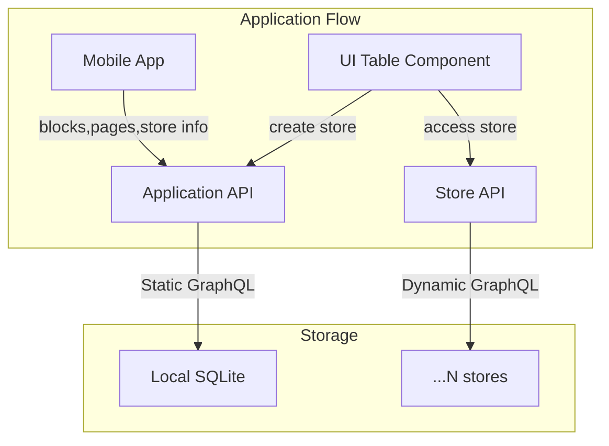

## Experiment 

This repo demonstrate a local GraphQL layer on top of SQLite, with the capability of managing multiple data stores that are dynamically created, and can be queried/mutated dynamically with GraphQL CRUD operations.

### Architecture

### Notes

1. The application data management is a hand-written GraphQL schema, it makes it easier to adjust to the app needs, instead of depending on a generated schema.
1. There are multiple SQLite databases here: one for the app, and `N` amount of databases created per each store. 
1. The application database holds records of all pages, blocks and everything else needed for managing the data. The block of type `Table` is a good reference for a table that has it's own data model.
1. The `type=table` datamodel is represented with a Subgraph definition, stored as part of the table block.
1. When the app needs to interact with a specific `type=table` block, it asks the application API for a `store` object. The store object provides a dynamically created GraphQL schema and a new SQLite created for that store. This way the Subgraph is always the source of truth for the store model. This could be also useful with a simple CRUD API, to simplify the need to generate queries, it can be as simple as: `getStore("store_store").entity("purpose").create({...})`.
1. Using the Subgraph definition as the source of truth gives us the following possibilites in the future:
    1. We can easily sync it remotely with other databases. 
    2. We can use `graphql-inspector` to detect breaking changes in the data model, and have better visibility on the changes.
    3. We can reuse the definition later for more purposes.   
