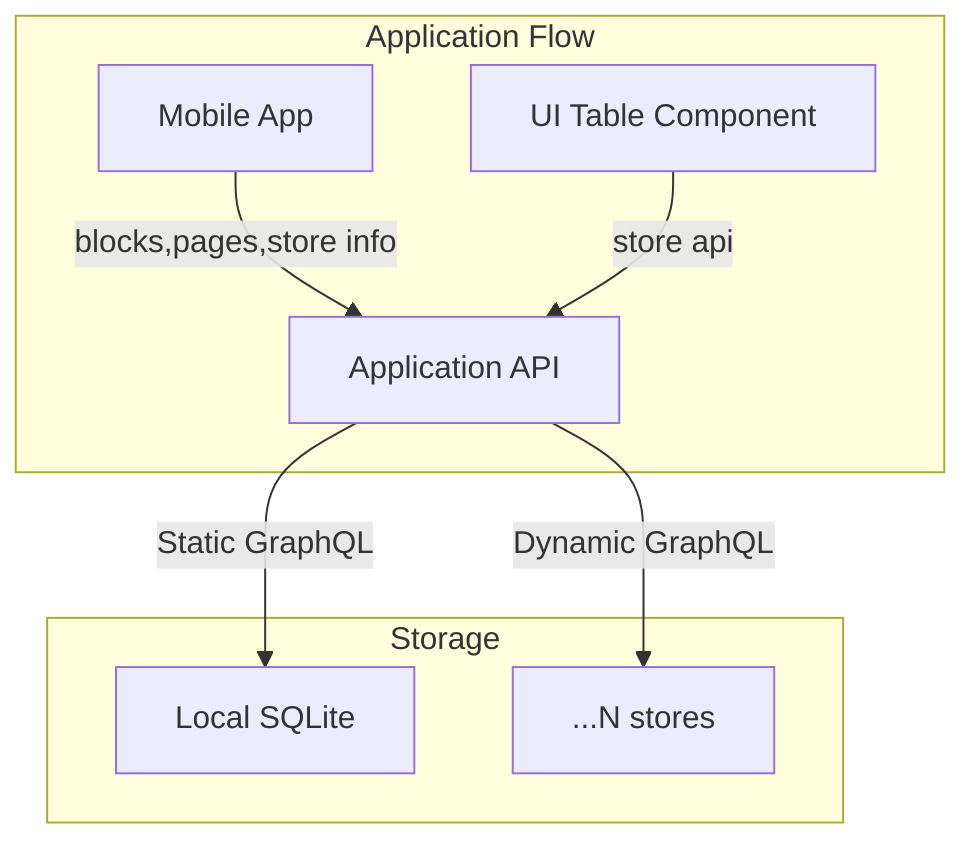

## Experiment 

This repo demonstrate a local GraphQL layer on top of SQLite, with the capability of managing multiple data stores that are dynamically created, and can be queried/mutated dynamically with GraphQL CRUD operations.

### Architecture

### Notes

 
